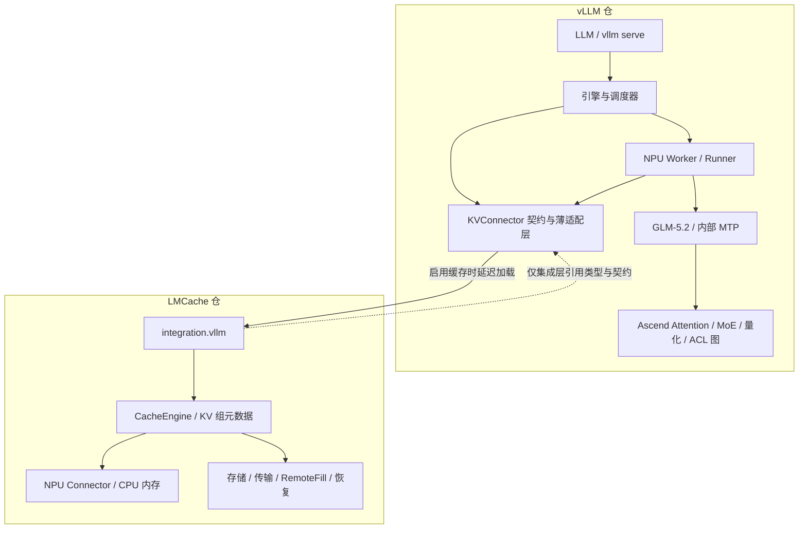

# Ascend 原生双仓重构设计

状态：设计已审核，用户已授权 P1 合仓与统一构建，尚未大规模裁剪。当前仅 GLM-5.2，GLM-5.3 后续扩展；DSA 双组/MTP 开启、C8 关闭。910B3、4×8 卡、2P2D，覆盖 TP8/DP2 与 TP4/DP4。基线由其他开发人员验证、后续归档，运行验收未宣告通过。本文描述目标实现，实际进展及候选软件版本见 [P1](p1/README.md)，历史见 [P0](p0/README.md)，验收见 [03](03-baseline-and-validation.md)。

## 1. 目标与边界

将 `vllm + vllm-ascend` 整合为推理仓，将 `LMCache + LMCache-Ascend` 整合为 KV 缓存仓。以当前四个 HEAD 为基线，保留其中目标模型相关能力，不追最新上游、不搬其他分支特性，不在合仓过程中顺带改写调度算法或实施性能优化。

“极简”定义为：只有经过范围确认的实现、入口、依赖和测试；每项保留内容都能追溯到目标模型或运行链路。源代码行数和 wheel 大小用于量化结果，不用预设删除百分比驱动裁剪。

### 1.1 能力清单

| 领域 | 目标 |
| --- | --- |
| 离线推理 | 保留 `LLM`、`SamplingParams`、批量 `generate`、文本 `chat`、tokenizer、采样及必要的 logprobs |
| 在线推理 | 保留 `vllm serve`、异步引擎、`/v1/models`、`/v1/completions`、`/v1/chat/completions`、SSE、健康检查、指标、取消和优雅退出 |
| 模型配套 | 保留 GLM-5.2 的 tokenizer、chat template、reasoning parser、tool parser、对应结构化输出能力 |
| 执行 | 保留 V1 引擎、连续批处理、chunked prefill、prefix caching、分页 KV、抢占/恢复；只保留 Ascend 算子和执行后端 |
| 并行 | 保留目标模型使用的 TP、EP、PP、DP 及必要的 CP/EPLB 路径；按已经具备的组合分别验收，不承诺所有组合均可用 |
| 图与推测解码 | 保留当前目标模型的 Eager、ACL 图、MTP，以及确有目标模型用途的推测解码公共组件；模式支持按矩阵确认 |
| KV | 保留本地 CPU 缓存、共享 CPU 缓存、磁盘及当前远端链路所需实现；保留 DSA 双组、索引共享、选择性加载和恢复语义 |
| 训练 | 删除 RLHF 权重更新/传输等训练协作专用 API、客户端和示例；不提供优化器、反向传播或训练任务 |
| 设备 | 模型执行仅 Ascend；不允许在 NPU 缺失时静默切换到 CPU/CUDA |

LoRA 加载已训练好的 adapter、MoE 路由、MTP 验证、采样和 prefix caching 都是推理功能，不能以“删除训练”为由直接移除。为缩小首版范围，建议另行审核是否裁剪 LoRA 推理及动态 adapter 管理；审核前保留相关依赖边界，不把它当作已授权的必删项。

用户在启动 P0 时进一步收窄模型范围：当前仅保留 GLM-5.2-w4a8c8 原生文本模型及其已有 MTP、DSA，GLM-5.3 在后续版本扩展。此前 DeepSeek/GLM 全系列白名单被此项取代；删除其他完整模型的对外实现和注册，但 GLM-5.2 使用的 DeepSeek/Llama/Eagle 等公共组件必须先按实际依赖提取。多模态及 Qwen/Llama 蒸馏仍在删除范围内。

用户同时确认保留当前分支目标模型相关能力，包括 DSA、CPU KV 卸载、跨实例缓存和 Prefill/Decode 分离，全部纳入回归验收。GLM 索引共享、不等 KV 分组、checkpoint、RemoteFill 和相关恢复机制作为现有链路组成部分保留；精简不能将这些能力降为可删项。保留的是当前已有能力和组合，不代表扩展原来不支持的组合。

## 2. 仓库与包布局

继续使用现有 `vllm/`、`LMCache/` 两个主体仓作为最终目录。各自一个 `.git`、一个顶层 `pyproject.toml`、一套版本和构建规则，不再要求独立安装 Ascend 插件包。外部 CANN、torch_npu、Mooncake 等是依赖，不是需要额外维护的本项目代码仓。

保留 Python 包名 `vllm`、`lmcache` 和现有核心入口。分发版本标识为本项目构建，锁定安装来源，避免解析器用公开同名包替换本地构建。第一轮不同时进行品牌改名。

以下是目标职责布局示意，允许在实施时沿用相邻的现有模块名称；不得因此建立第二套并行实现。

```text
vllm/
  pyproject.toml / setup.py / CMakeLists.txt
  vllm/
    entrypoints/                   # 离线、在线、CLI
    config/                        # 含原生 Ascend 配置与能力校验
    platforms/npu.py               # 唯一生产计算平台
    v1/core/                       # 调度、块管理、请求生命周期
    v1/worker/npu_model_runner.py   # 收敛后的主 Runner
    v1/worker/npu_worker.py
    v1/attention/backends/ascend/   # Dense / MLA / SFA
    compilation/                   # Ascend compiler、ACL 图和公共图逻辑
    model_executor/models/         # GLM-5.2、内部 MTP、必要的 common 组件
    model_executor/layers/         # 公共语义与 NPU 实现
    distributed/                   # HCCL、并行、Connector 接口
    distributed/kv_transfer/       # 推理侧 KV 生命周期与 sparse offload
    v1/spec_decode/                 # 合入当前 Ascend MTP 依赖
  csrc/ascend/                     # CANN / AscendC / host glue
  tests/ / examples/ / docs/ / requirements/ / docker/

LMCache/
  pyproject.toml / setup.py / CMakeLists.txt
  lmcache/
    v1/config.py                   # 完整静态配置定义
    v1/cache_engine.py             # 单一生产 CacheEngine
    v1/npu_connector/              # NPU gather / scatter / KV 布局
    v1/memory_management.py        # NPU 与 host-registered CPU 内存
    v1/storage_backend/            # 经确认保留的存储实现
    v1/transfer_channel/           # 经验证的 Ascend 传输实现
    v1/remote_fill/                # 协议、生产者、接收与恢复职责
    integration/vllm/              # vLLM Connector 的 LMCache 实现
    c_ops                          # 统一编译出的 Ascend 扩展
  csrc/ascend/
  tests/ / examples/ / docs/ / requirements/ / docker/
```

文档最终进入各主体仓自身的文档体系；本 `design/` 是本轮工作区评审材料，不另建第三个产品仓。

## 3. 两仓职责和依赖方向



职责约束：

1. vLLM 拥有请求调度、NPU KV 块分配、模型层执行、图捕获及 top-k 生成；LMCache 拥有缓存对象、主机内存、存储、传输完成和缓存恢复。
2. vLLM 不访问 LMCache 的私有字典、后台线程或对象引用计数；使用已有 Connector 公共方法。必须修正的私有访问形成明确、最小的契约变更，不在本轮重建一套 RPC 框架。
3. `lmcache` 核心不在顶层导入 vLLM。只有 `lmcache.integration.vllm` 依赖 vLLM 的类型和基类。
4. vLLM 关闭 LMCache 时可独立运行；开启时由薄 Connector 延迟加载 LMCache 集成实现。两个包的基础安装依赖不相互强制依赖，联合部署清单固定二者版本。
5. 不增加第三个公共 Python 包；跨仓 DTO 和接口以 vLLM Connector 契约为基准，缓存内部格式由 LMCache 负责，兼容性由配对版本和契约测试管理。

## 4. vLLM 原生 Ascend 改造

### 4.1 平台与启动

把 `NPUPlatform` 合入 `vllm/platforms/npu.py`，设为唯一生产平台。取消通过 `vllm.platform_plugins` 发现 Ascend 的必要性，移除 CUDA/ROCm/XPU/TPU/CPU 模型执行探测及注册。公共接口只保留当前 NPU 路径需要的部分，不为未来其他设备保留空后端。

配置和模型检查可在不初始化 NPU runtime 的情况下执行；真正设备初始化放在 Worker 启动和明确的运行时阶段。保留 spawn/多进程启动的初始化顺序，避免 import 或构建元数据生成阶段触发 CANN/设备上下文。

`pre_register_and_update` 的量化、默认配置和工具解析修正进入对应源码。配置检查先验证设备、模型、量化、图、并行、缓存组合，再分配内存和启动分布式操作。不支持的组合明确报错，不通过空实现返回成功。

### 4.2 Runner：先消除继承依赖，再删 GPU 代码

当前 `NPUModelRunner(ServingPerfMixin, GPUModelRunner)` 依赖 GPU Runner 的构造过程、方法及模块级符号。应逐项盘点 `super()`、未覆盖方法、属性初始化、异步输出类、input batch 和图调度依赖：

1. 将调度输入整理、请求状态、采样输出等仍有用途的逻辑提取为普通公共组件。
2. 将设备相关逻辑合入唯一 NPU Runner；显式使用 `torch.npu` 的 stream/event/memory API。
3. 将 `AsyncGPUModelRunnerOutput`、`AsyncIntermediateTensors` 等共享语义移到合适的公共模块并改名，保持结果等待和资源生命周期。
4. 消除 `_torch_cuda_wrapper`、对 `torch.cuda` 的临时替换、对 GPU Runner 模块函数的动态替换。
5. 完成对应功能对照后才删除 GPU Worker/Runner、设备算子和遗留导入。

当前还有 `worker/v2/model_runner.py`。这里的 v2 Runner 不等同于另一代产品引擎，不能因目录名字直接作取舍。首版以携带当前 DSA/恢复逻辑的 `model_runner_v1.py` 为收敛主线；v2 中若存在目标验收配置独有行为，必须先迁移或明确缩小范围，才能删除重复 Runner。

### 4.3 算子、编译、通信

将 Ascend 的 Attention、MLA/SFA、MoE、RMSNorm、RoPE、linear、sampler、quantization、通信实现移动到其语义归属位置。`CustomOp` / `PluggableLayer` 中的 OOT 替换改为原生绑定，公共层接口保持稳定。注册算子与运行时替换已有类是两种不同机制，前者可继续使用。

保留 torch_npu / CANN / AscendC，以及目标算子实际使用的 `triton-ascend`。不能仅因出现 `triton` 就删除 Ascend kernel。清除 CUDA FlashAttention/FlashInfer/FlashMLA/DeepGEMM、ROCm AITER、NCCL 等实现前，先移除公共模型文件中的导入和对应分支。

HCCL 负责 NPU 通信；Gloo、POSIX shm、CPU 控制消息及 NUMA 是主机侧能力，可以保留。NPU 型号差异使用少量 capability 判断，不重新引入多厂商插件发现。

首批硬件验收锁定 Ascend 910B3；算子编译目标和设备属性从该型号的实际工具链/设备信息确认。其他 Ascend 型号不属于首批认证范围，其代码是否裁剪仍由总体设计审核决定，不能由首批硬件选择直接推导删除 `_310p`。

### 4.4 图执行与 MTP

保留当前可用的 Eager、ACL FULL/PIECEWISE 路由和降级限制。`CUDAGraphMode`、`num_gpu_blocks` 等旧命名可先保持字段兼容，再迁为设备中性或 NPU 名称；名称兼容不应继续携带 CUDA 实现。

DSA layerwise 检索包含主机回调，不能未经验证并入一个连续 FULL graph。保留当前 staged SFA 在检索处拆分图岛的语义，以及模型状态变更前的 native/recompute/fatal 判定。能力未验收的组合继续拒绝或走已证明正确的路径。

`get_spec_decode_method` 当前把 `mtp` 路由到 `AscendEagleProposer`，后者还导入 `llama_eagle3`。删除其他模型前，拆出 MTP 真正需要的 proposer、metadata、rejection sampling 和 graph buffer 逻辑，再移除无关 Eagle/Llama 模型路径。验收必须覆盖候选生成、验证、accepted-token 边界、拒绝回退和 KV 游标，不能只验证 MTP 配置能启动。

## 5. 模型范围与依赖裁剪

### 5.1 文本模型架构白名单

当前仅保留 GLM-5.2-w4a8c8。下表是从源码推导的预期入口，必须用内网实际 `config.json` 和量化元数据核实后冻结；文件名、模型目录名和 registry 均不能代替具体权重/精度/硬件验证。

| 架构 | 当前实现 | 处理 |
| --- | --- | --- |
| `GlmMoeDsaForCausalLM` | `deepseek_v2.py` | GLM-5.2 主模型候选入口，绑定具体 config/hash；不是 GLM-5.1 或其他同架构权重的通用认证 |
| `DeepSeekMTPModel` | `deepseek_mtp.py` | `glm_moe_dsa` 经现有 speculative 配置映射出的内部 draft；只用于目标 GLM-5.2 MTP，不开放独立 DeepSeek 服务 |

其他 DeepSeek、ChatGLM、GLM-4/其他 GLM 版本和 Eagle 专用模型入口均不在当前对外支持范围。MTP 所需 proposer 和共享组件继续保留，但不借此开放额外 draft 模型。GLM-5.3 后续通过新增明确 profile、模型元数据与回归用例扩展；本轮不预置未经验证的 GLM-5.3 别名或 fallback。

W4A8C8 是现有权重标签，不能据此决定运行时 cache dtype。最新配置明确 C8 关闭，继续核实权重量化提供方、逐层回退、MTP 权重，以及实际非 C8 latent/index 的 dtype、布局和传输语义。权重和 C8 实现在 P1 不改写；C8-on 不再是本轮验收前提，后续是否删除其不可达代码由 P4 依赖闭包决定。

白名单同时作用于 CLI、离线构造、模型加载器、registry、`model_impl` fallback 和 draft model 检查。关闭可绕过范围约束的通用 Transformers/TerraTorch 执行 fallback 与外部模型注册入口；保留 Transformers 的 config/tokenizer/权重辅助功能。若目标 checkpoint 的 config/tokenizer 必须使用 remote code，按固定版本和明确用途处理，不能顺带启用任意远程模型实现。

架构白名单不等于模型品牌鉴定：同架构可能被其他模型复用。发布认证以明确的目标 checkpoint 清单为准；不通过目录名含 `deepseek` / `glm` 来判断是否支持。

### 5.2 必须先拆的共享依赖

- GLM-5.2 使用 `deepseek_v2.py` 内的 DSA/MoE 实现；保留 shared/full indexer、权重过滤和分组行为，最终移除不再支持的 DeepSeek 对外入口而不是整文件删除。
- `glm.py`、`glm4.py` 不再是本轮保留模型，不能继续为它们扩大公共 decoder 的提取范围；只有 GLM-5.2 实际闭包使用的 Llama 等组件才需提取。
- MTP 依赖名称含 Eagle 的通用执行组件；按调用关系提取，不按文件名整目录删除。
- MTP 经过 `glm_moe_dsa -> deepseek_mtp -> DeepSeekMTPModel` 的配置映射；量化权重、draft 初始化、采样/回退和 KV 游标共同验证。
- `models/utils.py`、`interfaces.py`、model loader、quantization utils、parser 基类中的其他模型引用也要纳入闭包分析。

抽取时保留权重键名、QKV 排列、RoPE 参数、特殊 token、EOS/stop 和 chat template 语义。纯改模块路径也可能影响缓存指纹、序列化及动态 import 字符串，需一并迁移。

### 5.3 已确认的模型删除范围

DeepSeek-R1 蒸馏版有基于 Qwen 和 Llama 的模型，见 [DeepSeek 官方模型表](https://github.com/deepseek-ai/DeepSeek-R1#deepseek-r1-distill-models)。这些蒸馏模型及独立原生 DeepSeek-R1 服务均不在当前 GLM-5.2-only 范围；删除非目标完整模型、注册和专用配套代码，不能因名称带有 DeepSeek 或 GLM 而保留。共享内部组件按 5.2 节处理。

删除多模态模型、视觉/语音 encoder、processor、media、encoder cache、多模态处理协议分支、测试和 torchvision/torchaudio 等仅因此存在的依赖。若任何文本公共工具仍引用这些模块，先拆依赖，再删除。离线和在线入口保留明确的文本输入校验，收到图像、音频、视频等不支持的输入时返回错误，不静默丢弃后继续生成。

GLM/MTP 当前从 Llama/Eagle 文件复用的必要代码先提取为公共组件；保留这些组件用于目标模型，不再暴露完整 Qwen/Llama 模型、蒸馏模型或其通用 draft 加载入口。裁剪验收同时检查源码/产物中的实现移除和运行时拒绝，不能只取消注册而保留整套非目标实现。

## 6. LMCache 原生 Ascend 改造

### 6.1 消除导入和安装补丁

把 `LMCache-Ascend/lmcache_ascend/__init__.py` 中的有效行为逐项迁到主体源码：

| 现有注入 | 目标归属 |
| --- | --- |
| 动态修改 `_CONFIG_DEFINITIONS`、重建配置类 | `lmcache/v1/config.py` 中一次性定义与校验 |
| `sys.modules['lmcache.c_ops']` / `non_cuda_equivalents` 替换 | 正式构建并直接导入 Ascend 扩展；CPU 内存辅助 API 显式定义 |
| `CreateGPUConnector` 替换 | 原生 `CreateNPUConnector` 和设备中性的基础接口 |
| CacheEngine / vLLM adapter 类替换 | 合并基类与 Ascend 实现，只保留一条生产实例化路径 |
| storage factory / IPC wrapper / transfer utils 替换 | 对应模块直接使用 Ascend 实现 |
| hash、lookup token 归一化、NUMA 和短 socket 路径修正 | 进入对应公共工具，保留现有语义及测试 |
| `torch_npu.contrib.transfer_to_npu` 和 capability mock | 显式 NPU API，删除对 CUDA API 的全局模拟 |

安装过程只安装本包文件，移除扫描并修改已安装 vLLM/SGLang 源码的 patch 机制。扩展模块命名、pybind 初始化符号、动态库依赖与 import 路径必须成套调整。

`AscendLMCacheEngine(LMCacheEngine)` 和 Ascend adapter 存在大量继承；不能用子类文件覆盖父类文件。按方法与状态归属合并，保留上游当前分支已具备的 group-aware、checkpoint、RemoteFill 和并发逻辑，避免“父类定制被覆盖”。

### 6.2 存储与传输保留原则

CPU KV 卸载、跨实例缓存和 P/D 分离已确认为必保能力。保留 CPU 内存/共享 slab、NPU 搬运、缓存索引和生命周期，以及当前目标链路所需磁盘、Mooncake Store、HCCL/HIXL/hcomm 传输、RemoteFill 和恢复机制；首批 CANN 8.5.1 profile 只启用完成验证的通信实现。未经验证的通道不能通过删除必保服务能力来绕过验收。

删除 CUDA/XPU/HPU Connector、GDS/CUDA IPC、CUDA/HIP 内核，以及对应 CuPy/CUDA、cufile、nvtx 等专用依赖。NIXL 在当前 Ascend storage factory 中被排除，可随相关实现一起移除。普通 C++ host allocator、序列化、内存注册、共享内存不能跟随整个 `csrc` 一起删除。

S3/Redis/Valkey、独立控制服务、native storage、Rust raw-block 等不应被误判为“其他厂商计算设备”。属于已确认推理/缓存链路依赖闭包的后端保留，其余在本次范围审核后删除。Mooncake 若为当前 RemoteFill 必需依赖，保留其客户端和配置，不把 Mooncake 服务端源码导入成第三个自维护仓库。

旧 `enable_pd` / `enable_p2p` backend 目前明确拒绝 `use_layerwise=true`。保留此限制，分别验收旧 PD/P2P 与 RemoteFill/DSA 路线，不能在合仓时把同名“P/D 支持”视为可以任意组合。

### 6.3 KV 分组与资源所有权

至少保留以下不变量：

1. MLA latent 与 DSA index 是独立语义组；共享 indexer 的 GLM 层可能没有自己的 index cache。
2. 每组层数量、层名和映射独立携带，不由 `num_hidden_layers` 推断全部组。现有测试的 `79 LATENT / 22 INDEXER` 是重要不等组用例，不是所有模型固定常量。
3. 区分模型层编号、组内存储编号、TP owner 和 MTP draft 层；共享层消费正确 producer 的 top-k。
4. host buffer 必须满足 Ascend 内存注册要求；跨进程共享只传可校验的 handle/offset/代际，不传另一个进程的裸指针。
5. 异步 store 的“提交成功”不同于“数据已安全保存”；依赖组/owner 完成后才能释放唯一 resident copy。
6. NPU producer、load、consumer 和释放之间的 stream/event 顺序不因搬文件而改变；取消、抢占和异常路径也必须清理。
7. 图 buffer、cache epoch、请求代际和 RemoteFill destination sealing 的绑定保持一致；旧地址失效后不得 replay。

## 7. 跨仓兼容契约

优先保留当前 `KVConnectorBase_V1` 的 scheduler/worker 分工及 `get_num_new_matched_tokens`、`update_state_after_alloc`、`build_connector_meta`、`start_load_kv`、`wait_for_layer_load`、`save_kv_layer`、`wait_for_save`、`get_finished`、`request_finished`、`handle_preemptions` 语义。

DSA/MTP/RemoteFill 已有的 capability、layerwise callbacks、worker metadata 聚合、live-source event handoff、destination sealing、placement/metrics 和故障重启指示，同步纳入跨仓契约清单。删除旧插件前必须证明这些能力仍从正式接口可达。

| 边界 | 需要固定的内容 |
| --- | --- |
| 版本 | 两仓 commit/wheel、Connector API 版本、缓存格式版本和配置 schema |
| 布局 | 每组 layer names/count、dtype、shape/stride、block/chunk size、layout、TP/PP 分片和 owner |
| 身份 | 模型 artifact/revision、权重/量化配置、tokenizer/缓存 namespace；不能只用显示模型名 |
| 生命周期 | producer-ready、load-complete、store-complete、释放、取消、抢占、代际失效 |
| 能力 | 稀疏选择性加载、layerwise、图回调、支持的组合；启动时协商/验证 |

第一轮保持当前 wire/cache 格式。只有发现现有字段无法正确表达原有语义才增加字段，并同时更新读写两侧。若必须改变布局，使用新 namespace/schema 隔离旧缓存，旧格式明确拒绝或按已验证的方式当作 miss；不静默读取旧字节，不把指针/布局类错误泛化为可恢复 cache miss。

两仓可分开测试与构建，但发布使用配对清单；影响协议的提交必须在配对分支一起验证，不能部署只更新了一侧的版本。

## 8. 构建、配置和依赖

### 8.1 内网构建与现有环境

构建与验证在内部局域网执行，可通过 proxy 访问互联网，但禁止直接接入外部大模型/AI 助手服务。本条取代此前“无互联网连接”的假设。本机不编译扩展、不生成目标 wheel，也不为此安装或更换本机 torch/CANN。审核通过后，本机交付可追溯的源码、构建配置、依赖清单和验证脚本；内网人员或 CI 执行构建及 NPU 验收，经人工审核、脱敏后交接必要日志/报告。本机静态检查通过不代表内网构建通过。

首批验收固定为用户指定的 Ascend 910B3、CANN 8.5.1、torch 2.9.0、torch_npu 2.9.0。用户已确认内网构建环境的 torch 为 2.9.0，直接复用；本轮未在该环境实测。Python、Ascend kernels、transformers、compressed-tensors 和 triton-ascend 等配套版本在内网 P0 核对并冻结。[torch_npu 官方版本说明](https://github.com/Ascend/pytorch#supported-pytorch-versions) 仅作准备阶段的参考资料，不是构建时需要访问的网站。

原始 vLLM/LMCache build-system 声明 torch 2.10.0，vllm-ascend requirements 声明 torch/torch_npu 2.9.0。P0 已独立对齐工作区构建声明，见 [修复记录](p0/changes/change-manifest.json)；运行兼容性尚未通过。整改对象仍包括 packaging、构建脚本、CI/镜像配置和必要源码适配，不要求重装现有 torch。核对仅在 2.10 中存在的 API、编译接口或 ABI；不能只替换版本字符串或通过自动升级改变验收目标。

当前 `LMCache-Ascend/setup.py` 的 `_is_cann_85_or_later` 在无显式覆盖且正确识别 CANN 8.5.1 时，会选择 HIXL/hcomm one-sided 构建路径。P0 需核对实际 SDK/库、符号和 910B3 上的行为，再冻结通道配置；该构建分支选择本身不证明硬件可用性，也不代表推理集合通信不再使用 HCCL。

每仓在内网分别输出 wheel 和 sdist，部署清单固定同一 ABI profile。默认使用已经准备好的内网环境，构建前检查 build backend、编译工具和 Python 依赖齐备，然后使用非隔离构建；不让 PEP 517 临时环境重新安装 torch。依赖元数据仍须正确声明 2.9.0，不能只用 `--no-build-isolation` 掩盖版本冲突。

### 8.2 代理访问、依赖获取与大模型接入边界

网络可达不等于所有服务均允许接入。依赖获取与本地目标模型推理按下表区分：

| 访问类型 | 设计边界 |
| --- | --- |
| 内网制品库、共享存储、源码及模型材料 | 可使用；记录版本、来源和校验值 |
| 公网依赖源、源码站点、官方文档、镜像及模型文件 | 按内网策略经 proxy 访问允许的来源；下载模型文件不等于调用外部模型推理服务 |
| 外部大模型 API、在线 AI 助手、云端 Agent 及其自动日志上传 | 禁止在验证环境接入；通过 proxy、中转或远程控制也不作为绕过方式 |
| 内网部署的目标 GLM-5.2 推理服务 | 按当前范围保留并验收；本地客户端只指向指定内网服务 |
| 内网 P/D、跨实例缓存、HCCL/HIXL/hcomm 及存储通信 | 保留直接内网通信，不经公网代理转发 |

本地推理测试可使用兼容协议客户端，但须显式指定内网目标地址，禁用公网默认端点及失败回退；不能因 SDK 名称含大模型服务商名称就删除本地服务测试所需依赖。内网 CI 的制品收集、日志汇聚和监控可保留，以下交接限制针对向外部环境或大模型服务传送数据。

代理地址、认证及企业 CA 由内网维护者配置，不在文档中假设实际值。按工具分别核对 HTTP(S)、Git、包管理器和容器引擎的代理生效范围；不能认为设置 `HTTP_PROXY` / `HTTPS_PROXY` 后所有工具都会遵循。`NO_PROXY` 按实际拓扑覆盖回环、内网服务域名/IP，涉及网段时核对各工具支持的写法；它不替代 HCCL 等通信库的网卡与路由配置。不使用关闭 TLS 校验解决证书问题；凭据通过环境或凭据管理设施注入，不提交仓库、不写入构建产物和诊断包。

缺失依赖优先从内网制品库获取，也可经代理从允许的固定来源下载。列出精确版本、平台标签、来源和校验值，尽量缓存后再构建；不重装符合要求的 torch，也不借用本机的 Python/CPU 架构选择内网 wheel。完整离线 wheelhouse/源码包可作为备选交付和复现方式，不再要求所有构建必须断网。代理不可用且缓存不齐时明确列出缺失项并停止，不静默改走公网直连、其他未批准源或升级依赖。

必须同时检查以下外部获取路径：Python 构建前端及 backend 的依赖安装、setup 脚本里的 HTTP 请求、CMake `FetchContent`/`ExternalProject`、Git clone/fetch/submodule/LFS、系统包安装、容器基础镜像和测试所需模型/数据。`--no-index` 只约束 pip 索引访问，不能阻止显式 URL 或自定义脚本联网。删除非目标设备的下载步骤；保留路径需要的第三方资源使用本地缓存、内网固定位置，或显式配置的代理下载，锁定版本/commit/digest 并校验。公网出口限制还需由内网网络策略落实，不能只依赖脚本约定。

源码交付须包含生成所需头文件、算子资源、实际子模块/LFS 内容和可在源码包内解析的版本信息；版本计算不能依赖临时在线 fetch tags。内网已有 SDK/库不重复打包，但须记录版本、路径和 ABI。依赖材料与两仓配对源码一起校验，缓存或材料目录不构成第三个维护仓库。

如需要部署镜像，基础镜像固定 digest，系统包和 Python 依赖固定版本；可从内网仓库或经代理获取并记录来源，不能使用浮动的 latest/未锁定更新替代环境基线。模型权重、config、tokenizer、经审核的必要 remote-code 文件和验收数据在准备阶段经内网材料或代理下载后固定到内网本地/共享存储；运行及性能验收不临时访问模型 Hub 或调用外部模型服务。CLI 工具若兼具文件下载和在线推理功能，只使用允许的材料获取路径。

验证环境不部署直连外部大模型的编码助手、Agent 或自动诊断回传组件，也不通过本机会话建立远程控制验证环境的链路。完整日志、trace、输入/输出样本在内网留存；对外仅按内部策略交接经人工审核、脱敏的最小诊断材料，不自动上传源码、权重、业务 prompt、生成结果或凭据。由用户明确选择可提供的内容供本机分析，再将修订的源码/脚本交由内网执行；若材料不能外发，在内网完成分析，仅反馈允许披露的结论。

### 8.3 产物与配置

构建只编译 NPU 与必要 host C++ 代码；删除 CUDA/HIP 预编译 wheel 下载、nvcc 检测、CUDA 架构变量、非目标 Dockerfile 和 CI job。保留 source wheel、editable install、普通 wheel 的验证，检查 C++ ABI、RPATH 和动态库依赖；有 CANN 工具链且显式给出 SOC 时，构建不应强制依赖可见 NPU。

完整记录传递依赖和实际 wheel 来源，避免获取依赖时引入 NVIDIA runtime；`triton-ascend` 使用的 `triton` 命名空间按来源识别。安装两仓产物前验证依赖已满足，再关闭自动依赖安装；安装后检查依赖与扩展加载，并对比 torch 的版本、位置和构建信息，确保未被替换。

配置收敛到各包自己的配置模块。已有 `VLLM_ASCEND_*` / `LMCACHE_*` 可以保留以减少部署变动；清除无关环境变量、无效 CLI 选项及帮助文档。删除配置项应明确报错或给出迁移提示，禁止静默忽略。

推理最小镜像与启用分布式 KV 的镜像可采用同一套代码的不同依赖 profile。它们不产生第三个仓库，也不携带未选用设备的 runtime。

## 9. 裁剪方式和最终约束

裁剪单位是“功能入口 + 依赖闭包 + 构建配置 + 测试/文档”，不是只删某个 Python 文件。结合静态 AST import、动态注册字符串、entry points、CMake 源列表、包数据和实际运行 import trace，生成明确的 `保留 / 提取后删除 / 删除 / 待确认` 清单。

最终应满足：

- 生产可安装源码只含两个包，不依赖 `vllm_ascend`、`lmcache_ascend` 导入或对应 entry points。
- 没有针对本项目两仓的运行时 monkey patch、`sys.modules` 重定向和安装后源码改写；测试 mock 不受此限制。
- 无非 Ascend 计算后端、对应专用内核和强制依赖；保留 CPU 主机功能。
- 模型、任务、量化、Attention、Connector 和 parser 的注册项均可追溯到批准的范围。
- 关闭缓存的离线/在线推理和开启缓存的联合推理都可独立验收。
- 删除的是当前源码树中的无关实现；保留 Git 历史、来源记录、LICENSE/NOTICE 和必要版权头。
